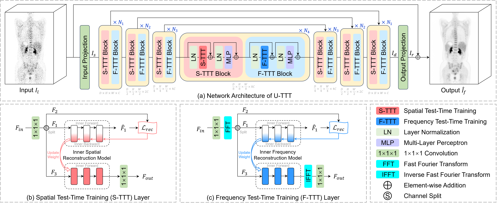
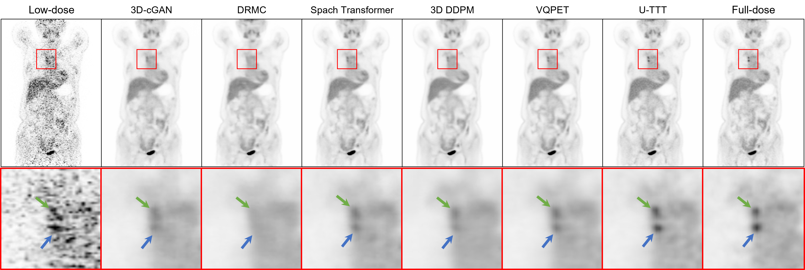

# U-TTT: Towards Generalizable PET Image Denoising via Test-Time Training[](https://arxiv.org/abs/2606.11032)

At present, we release only the model architecture code. The complete codebase will be made available upon acceptance of the paper.

## Network Architecture



## Result



## Citation

If you find **TAT** useful in your research, please consider citing:

```bibtex
@misc{yang2026U_TTT,
      title={U-TTT: Towards Generalizable PET Image Denoising via Test-Time Training}, 
      author={Zhiwen Yang and Jiayin Li and Hao Lu and Hui Zhang and Zihua Wang and Bingzheng Wei and Yan Xu},
      year={2026},
      eprint={2606.11032},
      archivePrefix={arXiv},
      primaryClass={cs.CV},
      url={https://arxiv.org/abs/2606.11032}, 
}
```

## Acknowledgments

Thanks for the awesome [VITTT](https://github.com/LeapLabTHU/ViTTT) repository.
